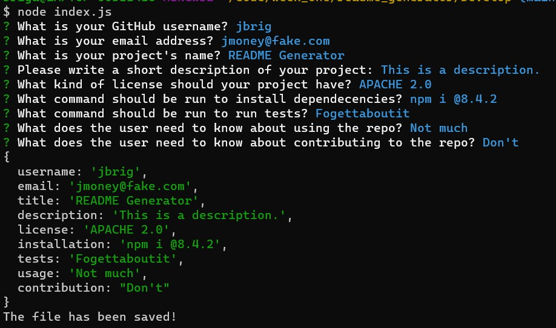

# README Generator

## Description
There are easy ways to complete repetitive tasks and there are hard ways. The easiest way is now by running a simple javascript file from your command line, and enjoy the product! Creating this project required installing the inquirer package of node.js to run prompts on the command line. It's really amazing what you can do with a few lines of javascript in node.js. 

## Installation
Please follow the instructions below
1. Clone the [the README generator repository](https://github.com/brigantinojoe/readme_generator)
2. Open a terminal of your choice and move to the same directory that you cloned the repository. 
3. Run the following command on your terminal
    ```
    npm i inquirer@8.2.4
    ``` 
## Usage
1. Once the inquirer package download is complete, go back to your terminal and navigate to the "Develop" folder from the cloned repository and type the following command:
    ```
    node index.js
    ```
2. Answer the prompts initiated by the previous command.
3. Once completed, the terminal will indicate that the new README file has been saved like in the screenshot below:



4. Navigate to your "Develop" directory and enjoy your new README!